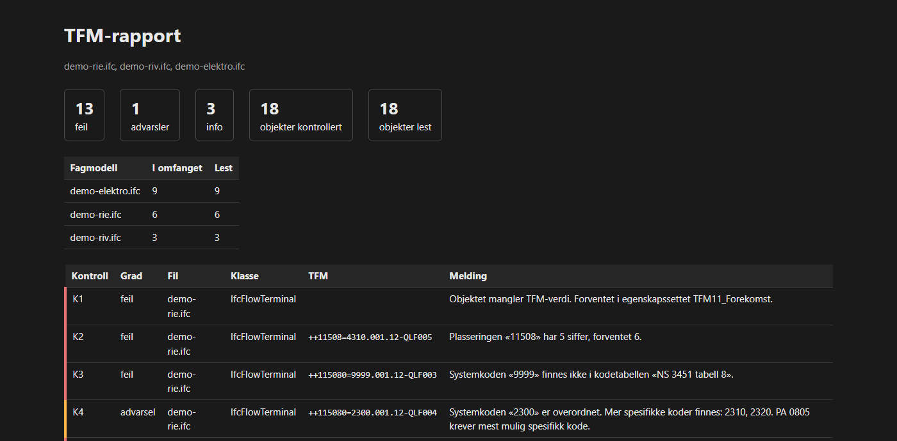

# tfm-sjekk

[](https://github.com/alegri1/tfm-sjekk/actions/workflows/test.yml)
[](https://github.com/alegri1/tfm-sjekk/actions/workflows/bygg.yml)
[](https://pypi.org/project/tfm-sjekk/)
[](https://pypi.org/project/tfm-sjekk/)

Validerer TFM-merking i IFC-modeller mot NS 3457-serien og prosjektets TFM-master.

> **Status: virker, men er ikke prøvd i et ekte prosjekt.** Elleve kontroller,
> fire rapportformater, og BCF-fila er prøvd i BIMcollab ZOOM. Ingen norsk
> fagmodell har vært gjennom verktøyet, og hypotesen bak det er ikke validert —
> se §11 i spesifikasjonen. Si fra hvis noe ikke stemmer med hvordan dere
> jobber; det er akkurat det jeg vil vite.

---

## Problemet

Norske byggeprosjekter krever tverrfaglig merking (TFM) av objekter i BIM-modellene,
men i praksis er merkingen inkonsistent. Feil oppdages ofte først ved modelleveranse
til arkiv eller ved overlevering til FDV — altså for sent og for dyrt.

En TFM-ID ser slik ut:

```
++115080=3600.001.04-JVZ001%JVZ.001.008
```

Skriv `4310` der `4310.001.00` mangler kursnummer, eller gjenbruk `QLF001` i to
fagmodeller, og ingen oppdager det før i FDV-fasen.

## Rapporten

*Demomodellene, som har én tilsiktet feil per kontroll. Dekningstabellen sier
hvor mye som faktisk ble kontrollert — her 18 av 18. Står det 0, er «ingen funn»
ikke det samme som «ingen feil».*

Hver kjøring gir en selvstendig HTML-rapport med sorterbar tabell, en BCF-fil
som åpnes i Solibri, Catenda, Dalux og BIMcollab, en XLSX til analyse, og en
exit-kode til CI.

## Hvorfor ikke bare IDS eller Solibri?

**IDS** er per design begrenset til det som kan avgjøres på ett objekt om gangen.
Det dekker K1–K5. Men det kan ikke uttrykke at ingen to objekter deler
komponentforekomst-ID, at et system finnes i prosjektets master, eller at et
kursnummer stemmer med fordelingen objektet er tilkoblet.

**Solibri** gjør relasjonssjekker, men regelsettet er internasjonalt og generisk —
det kan ikke NS 3451-tabellen, NS 3457-8-kodene eller PA 0805s regler, og det koster
lisens.

Nisjen er norsk-spesifikk, relasjonell, gratis og kjørbar i CI.

## Kontrollene

| # | Kontroll | Springer ut av | Grad |
|---|---|---|---|
| K1 | Alle objekter i konfigurerte IFC-klasser har en TFM-verdi | krav om merking | feil |
| K2 | TFM-ID-en følger grammatikken | TFM-strukturen | feil |
| K3 | Systemkoden finnes i kodetabellen | NS 3451 tabell 8 | feil |
| K4 | Systemkoden er angitt så spesifikt som mulig | PA 0805 | advarsel |
| K5 | Komponentkoden finnes i kodetabellen | NS 3457-8 | feil |
| K6 | Komponentforekomster er unike, også på tvers av fagmodeller | krav om entydig ID | feil |
| K7 | Systemer og typer finnes i prosjektets TFM-master | SIMBA | feil |
| K8 | Elektro: kurs-/sløyfenummer utfylt og konsistent | NS 3451 kap. 4 og 5 | feil |
| K9 | MMI/prosesstatus satt og konsistent innenfor systemet | SIMBA | info |
| T1 | Komponenttypen er den samme i TFM-ID-en og i typefeltet | to felt, én sannhet | feil |
| D1 | Noe ble faktisk kontrollert i hver fagmodell | egen erfaring | advarsel |

K1–K9 er kontrollene i §4 i spesifikasjonen. T1 og D1 kom til etterpå, da det
viste seg at samme opplysning kan stå to steder i en modell, og at fravær av
funn ellers ikke er til å skille fra at ingenting ble undersøkt.

Alle kan slås av eller få endret alvorlighetsgrad i `tfm-sjekk.toml` — TFM-
tolkningene varierer mellom prosjekter, og da må regelsettet være data.

## Installasjon

```bash
pipx install tfm-sjekk
```

**Uten Python:** last ned den frittstående binæren fra
[siste utgivelse](https://github.com/alegri1/tfm-sjekk/releases/latest) —
`tfm-sjekk-windows.exe`, `tfm-sjekk-macos` eller `tfm-sjekk-linux`. Én fil,
ingen installasjon, og lenka virker uten GitHub-konto. Mange BIM-koordinatorer
har ikke Python og får ikke lov til å installere det heller (§6).

På macOS og Linux må fila gjøres kjørbar etter nedlasting — `chmod +x
tfm-sjekk-macos` — og macOS krever i tillegg `xattr -d com.apple.quarantine
tfm-sjekk-macos`, siden binæren er usignert.

Bygge den selv:

```bash
uv run pyinstaller tfm-sjekk.spec --noconfirm   # → dist/tfm-sjekk[.exe]
```

Binæren blir rundt 57 MB, fordi `ifcopenshell` alene er 82 MB på disk, og
bruker et par sekunder på å starte: én fil betyr at alt pakkes ut i minnet ved
hver kjøring. Det er byttehandelen mot å slippe installasjon.

### Uten kommandolinje

**Dra IFC-filene oppå `tfm-sjekk.exe`** i Utforskeren. Rapportene havner i en
mappe som heter `rapport` ved siden av modellene. Flere filer på én gang
federeres, som er det K6 trenger for å finne duplikater på tvers av fagmodeller.

Uten kodetabeller hopper K3, K4, K5 og K7 over — de trenger `--systemtabell`,
`--komponenttabell` og `--master`, og da må du på kommandolinja. Resten kjører.

**Dobbeltklikk** viser en kort bruksanvisning og lar vinduet stå til du trykker
Enter. Uten det ville Windows lukket konsollen i samme øyeblikk programmet var
ferdig, og du hadde ikke rukket å lese noe.

## Bruk

```bash
tfm-sjekk sjekk rie.ifc riv.ifc
```

Så kort fordi prosjektet ditt legger en `tfm-sjekk.toml` ved siden av
modellene, med stiene til mastera og kodetabellene:

```toml
tfm_master = "TFM-master.xlsx"
systemtabell = "tabeller/min-ns3451.csv"
komponenttabell = "tabeller/min-ns3457-8.csv"
```

Fila finnes automatisk — hos modellen først, ellers i mappa du står i — og
kjøringen sier hvilken den leste. Stiene er relative til oppsettsfila, ikke til
der du står, så mappa kan flyttes og sendes videre.

**Repoets egen `tfm-sjekk.toml` har de tre linjene kommentert ut.** Den er en
mal over alle nøklene med standardverdiene sine, ikke et prosjektoppsett — og en
ekte TFM-master kan ikke ligge her (§8), så det finnes ingenting for stiene å
peke på.

Vil du se det virke, ligger et utfylt oppsett i `eksempler/tfm-sjekk-full.toml`.
Det peker på de fiktive tabellene, og kommandoen blir like kort som over:

```bash
uv run tfm-sjekk sjekk eksempler/demo-*.ifc --config eksempler/tfm-sjekk-full.toml
```

Kopier den til `tfm-sjekk.toml` ved siden av modellene, og `--config` trengs
heller ikke.

### Den faste ruten

Skal modellen rettes, kjøres den samme kommandoen mange ganger, og da er det
verdt å slippe å finne eksporten igjen for hånd. Oppsettet kan bære hele ruten:

```toml
modeller = ["eksport/*.ifc"]
ut = "rapport"
```

Da er runden `tfm-sjekk sjekk` uten argumenter. Mønsteret betyr at en ny
fagmodell bare skal legges i mappa, ikke skrives opp noe sted i tillegg, og
`ut` betyr at neste ledd — Dynamo-grafen som leser `rapport/funn.csv` — kan
peke dit én gang og aldri endres.

Filer på kommandolinja vinner over `modeller`, og `--ut` vinner over `ut`, så en
enkeltfil kan sjekkes uten å røre prosjektets rute.

**Et mønster som ikke treffer noen fil stopper kjøringen** med exit 2. Ruten
skrives én gang og leses aldri igjen; en eksport som havnet i feil mappe ville
ellers gitt en tom, grønn rapport hver eneste runde, og ingenting i den ville
sagt at den handlet om null objekter.

En nøkkel verktøyet ikke kjenner **stopper kjøringen** med exit 2, og meldingen
sier hvilken nøkkel, hvilken seksjon, og hva den nærmeste gyldige heter:

```
Feil i tfm-sjekk.toml:
  Ukjent nøkkel «foring_systemkode» i [elektro].
  Mente du «foring_systemkoder»?
```

Står nøkkelen riktig skrevet i feil seksjon, sier meldingen hvor den hører
hjemme i stedet. Seksjonsinndelingen i TOML er usynlig når man skriver, og en
nøkkel under feil overskrift ser ut som en nøkkel på riktig sted:

```
Feil i tfm-sjekk.toml:
  Ukjent nøkkel «ifc_klasser» i [pset].
  Den hører hjemme på toppnivå.
```

Det er samme regel som for en sti som peker feil. En forkastet nøkkel ville gitt
en rapport laget med andre regler enn du ba om — og den ser like ren ut.

Har du ikke laget et oppsett ennå, oppgir du det samme som flagg:

```bash
tfm-sjekk sjekk rie.ifc riv.ifc \
    --systemtabell min-ns3451.csv \
    --komponenttabell min-ns3457-8.csv \
    --master tfm-master.xlsx \
    --ut rapport/
```

Et flagg vinner alltid over fila. Og peker en sti i oppsettet på noe som ikke
finnes, stopper kjøringen — den hopper ikke over kontrollen som om du hadde
valgt å kjøre uten.

Flere filer federeres og kontrolleres samlet — det er slik K6 finner duplikater
på tvers av fagmodeller.

Verktøyet står som port i en leveranseprosess, og exit-koden har tre verdier:

| Kode | Betyr | Hva du gjør |
|---|---|---|
| 0 | ingen feil | ingenting |
| 1 | modellen har feil | rett merkingen |
| 2 | kjøringen kunne ikke gjennomføres | rett kommandoen eller skaff en hel fil |

**2 er ikke en dårligere 1.** «Fagmodellen har 40 K1-feil» og «fila lot seg ikke
åpne» stopper begge leveransen, men bare den ene er noe entreprenøren kan rette.
Koden er 2 når en sti peker feil, når oppsettet ikke lar seg lese, når en rute
ikke treffer noen fil, når en modellfil er tom, ikke er IFC eller ser avkuttet
ut, når en kodetabell eller TFM-master ikke lar seg lese — og når en rapportfil
ikke lar seg skrive.

Det siste er hyppigere enn det høres ut som. Rettingsrunden er: kjør, åpne
rapporten, rett modellen, kjør igjen — og på Windows nekter Excel andre å skrive
til fila den har åpen. **Da endres ingen av rapportfilene.** Enten er alle fire
fra denne runden, eller så er alle fra den forrige; mappa står aldri igjen med
en fersk HTML ved siden av en BCF fra sist.

```
«funn.xlsx» kunne ikke skrives: Access is denied. Er fila åpen i et annet
program? Lukk den og kjør på nytt. Ingen av rapportfilene er endret.
```

Tabellene leses **før** modellene, så en skrivefeil i en tabellsti koster ikke
en full federert kjøring før den oppdages.

En avbrutt eksport er den viktigste av dem. Fila åpner seg fint og inneholder en
brøkdel av modellen, så en kjøring på den ville rapportert sant om det den så og
misvisende om modellen. Mangler avslutningen `END-ISO-10303-21;`, stopper
kjøringen framfor å svare på en halv fil, og ingen rapport skrives.

Hver kjøring skriver fire filer til `--ut`:

| Fil | Til hva |
|---|---|
| `funn.bcfzip` | BCF 2.1 — åpnes i Solibri, Catenda, Dalux, BIMcollab |
| `rapport.html` | Én selvstendig fil med sorterbar tabell, til deling |
| `funn.xlsx` | For analyse i Excel — frosset overskriftsrad og filter |
| `funn.csv` | Semikolonseparert UTF-8, for skript og pandas |

Prøv det med demomodellene:

```bash
uv run python eksempler/lag_demomodell.py
uv run tfm-sjekk sjekk eksempler/demo-rie.ifc eksempler/demo-riv.ifc eksempler/demo-elektro.ifc \
    --systemtabell eksempler/FIKTIV-systemkoder.csv \
    --komponenttabell eksempler/FIKTIV-komponentkoder.csv \
    --master eksempler/FIKTIV-tfm-master.csv
```

`tfm-sjekk kontroller` lister kontrollene og statusen deres.

### Første møte med et prosjekt

Du har en fagmodell og ingen `tfm-sjekk.toml`. Da er spørsmålet hvor TFM-verdiene
faktisk ligger i denne modellen — og det vet verktøyet allerede, fordi det leter
flere steder enn i det konfigurerte og holder rede på hvor det fant hver verdi.

```bash
tfm-sjekk oppsett rie.ifc riv.ifc > tfm-sjekk.toml
```

Kommandoen kjører ingen kontroller og trenger verken master eller kodetabeller.
Den skriver et utkast som bare inneholder det som avviker fra standardverdiene,
med belegget for hvert forslag i en kommentar over det:

```toml
# TFM-forekomst: egenskapssett
forekomst = [
    "TFM11_Forekomst",
    # 840 objekter, gjenkjent feltnavn i et egenskapssett som ikke er konfigurert
    "Data",
]
```

Antallet er ikke pynt. Forskjellen mellom et egenskapssett brukt på 840 objekter
og ett brukt på 2 er forskjellen mellom en prosjektkonvensjon og en tilfeldighet,
og det er du som avgjør hvilken av dem det er. **Les fila før du tar den i bruk.**

Forslaget dekker også `ifc_klasser`, men bare klasser utenfor omfanget som *har*
TFM-verdier. Det er svaret på «0 av 412»: at en klasse finnes i fila betyr
ingenting, men at objektene er merket betyr at noen mente de skulle med.

Med `--ut` skrives fila i stedet for skjermen, og en fil som finnes fra før
røres ikke uten `--overskriv`.

Demoen lager en modell med verdiene bevisst på avveie, så du kan se hele runden:

```bash
uv run tfm-sjekk sjekk eksempler/avveie.ifc            # 3 av 4 i omfanget
uv run tfm-sjekk oppsett eksempler/avveie.ifc --ut forslag.toml
uv run tfm-sjekk sjekk eksempler/avveie.ifc --config forslag.toml   # 4 av 4
```

Den fjerde er en `IfcBuildingElementProxy` med TFM-verdi — utstyr eksportert i
feil klasse. Forslaget finner den, og etter at det er tatt i bruk er den med.

#### Én grense verdt å kjenne

`oppsett` kan lukke ett hull om gangen, ikke to samtidig. Verdiuttrekket har tre
strategier, og alle trenger minst ett kjent holdepunkt:

| Hvor verdien ligger | Verktøyet | `oppsett` |
|---|---|---|
| Ukjent egenskapssett, kjent feltnavn | finner den | foreslår egenskapssettet |
| Kjent egenskapssett, ukjent feltnavn | finner den | foreslår feltnavnet |
| **Ukjent begge deler** | **ser ingenting** | **kan ikke hjelpe** |

`eksempler/blindsone.ifc` er det siste tilfellet: førti objekter merket helt
korrekt, i `AnleggsData.Anleggskode`. Verktøyet melder førti K1-feil, og
`oppsett` sier at det ikke fant noe å bygge på.

```bash
uv run tfm-sjekk oppsett eksempler/blindsone.ifc
# Ingenting å bygge på: ingen av objektene hadde TFM-verdi.
```

Skjer dette, må du oppgi holdepunktet selv — legg egenskapssettet eller
feltnavnet inn i `tfm-sjekk.toml` for hånd, og kjør `oppsett` på nytt. Da har
den noe å gå ut fra, og finner resten.

Grensen er bevisst. Alternativet er å skanne hvert felt i hvert egenskapssett og
stole på at verdien *ser ut som* en TFM-ID — en langt løsere slutning enn de
øvrige, og en beslutning som fortjener sin egen vurdering.

### Føringsveier eksporten ikke merket som føringsveier

K8 krever kursnummer av elektroobjekter, og unntar føringsveier: et kabelrør
bærer kurser og ligger ikke på en. Unntaket kjenner dem normalt på IFC-klassen.

Det holder ikke alltid. En ekte Revit-eksport av Snowdon Towers ga seksten
koblingsbokser som `IfcBuildingElementProxy` — en anonym boks. TFM-en sa
føringsvei, klassen sa ingenting, og K8 trodde på klassen.

```bash
uv run tfm-sjekk sjekk eksempler/foringsvei.ifc
# 2 feil — uttaket mangler kursnummer, og koblingsboksen «mangler» det også

uv run tfm-sjekk sjekk eksempler/foringsvei.ifc --config eksempler/foringsvei.toml
# 1 feil — bare uttaket. Koblingsboksen er kjent igjen på systemkoden
```

Kabelrøret i modellen meldes ingen av gangene: det er `IfcFlowSegment`, som
standardlista dekker. De to kjennetegnene virker ved siden av hverandre, og å
konfigurere systemkoder slår ikke av klasselista.

```toml
[elektro]
foring_systemkoder = ["4340"]
```

Koden i eksempelet er fiktiv. Hvilken kode som betyr føringsvei står i NS 3451,
og innholdet ligger ikke i verktøyet (§8) — derfor er standardlista tom, og
prosjektet skriver inn sin egen.

### Modeller i tidligfase

En tidlig modell har ikke alltid fått byggnummer. Systemet og komponenten er
merket, men `++115080`-delen er ikke bestemt ennå. Med standardoppsettet gir det
et syntaksfunn på hvert eneste objekt — om en del prosjektet ikke har tatt
stilling til.

```bash
uv run tfm-sjekk sjekk eksempler/tidligfase.ifc
# 5 feil — alle «Mangler ++-delen»

uv run tfm-sjekk sjekk eksempler/tidligfase.ifc --config eksempler/tidligfase.toml
# 2 feil — et ekte K6-duplikat som lå skjult under støyen
```

Du trenger ikke kjenne innstillingen på forhånd — verktøyet finner den selv:

```bash
uv run tfm-sjekk oppsett eksempler/tidligfase.ifc
```

```toml
[grammatikk]

# 5 verdier feiler bare fordi plasseringen («++»-delen) mangler.
# Til sammenligning: ingen andre verdier parser.
# Er dette en tidlig fase, er linja under riktig. Er det en merkefeil,
# skal den strykes — verktøyet kan ikke se forskjellen, det kan du.
krev_plassering = false
```

Begge tallene står der med hensikt. 5 mot 0 er en modell som ikke har fått
byggnummer ennå. Var det 3 som feilet mens 40 parset, ville det vært tre objekter
merket feil — og da skal forslaget strykes.

Forslaget gis bare når innstillingen får **hver eneste** verdi til å parse. Løser
den bare noen av dem, er det merkefeil og ikke fase, og verktøyet foreslår
ingenting.

Merk hva som *ikke* skjer: en TFM-ID med feil plassering avvises fortsatt.
Valgfri betyr at delen kan utelates, ikke at den kan være feil. Og K6 måler
unikhet på delene som finnes, så to bygg med samme system og komponent regnes
ikke som duplikater bare fordi plasseringen er valgfri.

Sett verdien tilbake til `true` når byggnummeret er ført inn — da fanges de
objektene som fortsatt mangler det.

### Funn tilbake til Revit

BCF fungerer i en viewer, men rettingen skjer i Revit. `dynamo/` inneholder et
Python-skript for en Dynamo-graf som leser `funn.csv` og skriver avviksteksten
inn i en parameter på hvert element — da får du en schedule som tømmer seg selv
etter hvert som du retter.

Ingen plugin, ingen installasjon. Se [dynamo/LES-MEG.md](dynamo/LES-MEG.md) for
oppsett, og for hvilke to slags funn som ikke kan kobles til et element.

### Prøve BCF-en i en viewer

Demomodellene har prosjekt, enheter, romlig struktur og geometri — alt en viewer
trenger for å åpne fila og faktisk vise noe. Kontrollene bryr seg ikke om noe av
det, men BCF-en gjør: et viewpoint kan bare vises hvis modellen har noe å vise.

```bash
uv run tfm-sjekk sjekk eksempler/demo-*.ifc --config eksempler/tfm-sjekk-full.toml --ut rapport
```

Åpne så demomodellene i Catenda, BIMcollab ZOOM eller Solibri Anywhere og
importer `rapport/funn.bcfzip`. Et emne skal velge nøyaktig det objektet det
gjelder, og kameraet skal stå fire meter unna — det er den koblingen som gjør
BCF verdt bryet, og den eneste delen av formatet et skjema ikke kan verifisere.

De to emnene uten viewpoint er K7-funn om oppføringer i mastera som ikke er
modellert. De peker ikke på et objekt, så det er ingenting å zoome til.

`eksempler/visning-2x3.ifc` er den samme modellen i IFC 2x3, til import i Revit.
Den skal ikke kjøres sammen med `demo-*.ifc` — den har de samme TFM-verdiene, og
K6 ville funnet hver eneste komponentforekomst i to filer.

## Avgrensning

Ingen GUI, ingen 3D-visning, ingen Revit-plugin, ingen webapp, ingen skriving tilbake
til modellen, ingen støtte for samferdsel. Se §3 og §10 i spesifikasjonen.

## Om standardene og kodetabellene

**NS 3451 og NS 3457-serien er betalte standarder fra Standard Norge. Kodetabellene
følger ikke med dette verktøyet, og de skal ikke legges i dette repoet.**

Du peker på dine egne CSV-filer med `--systemtabell` og `--komponenttabell`:

```
kode;beskrivelse
2310;<beskrivelse fra standarden>
```

Filene under `eksempler/` er fiktive og ikke-normative — de bærer prefikset
`FIKTIV-`, og finnes bare for at testene og demoen skal kunne kjøre.

Dette gjør verktøyet lovlig å publisere, og det gjør det generelt: en byggherre med
eget kodeverk kan bruke det med sin egen tabell.

---

Avsnittene under er oppslagsverk — de forklarer valg verktøyet har tatt,
og trengs først når noe oppfører seg uventet.

## Komponenttypen står to steder

Komponenttypen kan stå både i `%`-delen av TFM-ID-en og i et eget egenskapssett:

```
TFM11_Forekomst:  ++115080=3600.001.04-JVZ001%JVZ.001.008
TFM11_Type:                                   JVZ.001.008
```

`%`-delen har forrang — den er en del av selve TFM-ID-en. Mangler den, som er
vanlig siden `krev_komponenttype` er `false` som standard, gjelder typefeltet. Uten
den regelen hoppet K7 over hvert objekt uten `%`-del, og sjekket i praksis
komponenttyper mot mastera for en forsvinnende liten del av en modell.

**Er de to uenige, er det en feil (T1).** Da har objektet ingen avklart
komponenttype, og K7 tier om det: et funn om mastera ville hvilt på et vilkårlig
valg mellom to verdier. Rett spriket først.

## Hva «ingen funn» betyr

Rapporten oppgir alltid **hvor mye som ble kontrollert**, per fagmodell:

```
rie.ifc   184 av 210 objekter i omfanget
riv.ifc    96 av 140 objekter i omfanget
ark.ifc     0 av 412 objekter i omfanget   <- ingenting kontrollert
```

Uten det tallet er fravær av funn tvetydig: det kan bety at merkingen er i orden,
eller at ingen kontroll hadde noe å se på. Omfanget bestemmes av `ifc_klasser`, så
en modell uten tekniske fag — eller en eksport som legger utstyr i
`IfcBuildingElementProxy` — gir null i omfanget og en rapport som ser ren ut.

Oppsummeringslinja teller **hver grad som har funn**, og navngir **hver fil
som ble skrevet**:

```
13 feil, 1 advarsel, 3 info → rapport\rapport.html, rapport\funn.csv, rapport\funn.xlsx, rapport\funn.bcfzip
```

En grad uten funn nevnes ikke, og en kjøring helt uten funn sier «ingen funn».
Advarsler og info endrer ikke exit-koden, men de står i rapporten — og en linje
som ikke teller dem lar dem gå ubemerket forbi. Det samme gjelder et format
ingen vet finnes: navngir linja to av fire filer, er de to andre skrevet til
ingen.

En fagmodell med tomt omfang gir en **advarsel**, ikke en feil. Exit-koden er
uendret, slik at et legitimt kjør på en arkitektmodell ikke stenger porten i CI.
Meldingen nevner klassene fila faktisk inneholder, så den er nok til å rette
`ifc_klasser`.

### Omfang per fagmodell

Meldingen over spør «skal denne fila sjekkes?». For en arkitektmodell er svaret
ofte verken *utvid* eller *la være*, men **«ikke sjekk den for TFM — men ha den
med»**. Arkitekten tegner armaturer og servanter for å vise rommet, og de skal
ikke merkes av RIE.

Det er ikke teoretisk. Kjørt mot Autodesks Snowdon Towers med fire fagmodeller
ga arkitektmodellen 675 K1-funn på slikt utstyr, mot 177 ekte funn i
elektromodellen. Rapporten var teknisk korrekt og ubrukelig som arbeidsliste.

```toml
[fagmodell."*Architectural*"]
ifc_klasser = []
```

Tom liste betyr at fila ikke kontrolleres for TFM. Nøkkelen er et
filnavnmønster; treffer flere samme fil, gjelder det lengste, og to like lange
stopper kjøringen framfor å gjette. Unntaket står i utskriften:

```
ark.ifc   unntatt — kontrolleres ikke for TFM (7745 objekter lest)
rie.ifc   1492 av 2439 objekter i omfanget
```

**En unntatt fil er ikke usynlig.** K3–K8 leser alle objekter med en TFM-verdi,
uansett klasse, så K6 finner fortsatt duplikater på tvers av den og
elektromodellen — som er hele grunnen til å federere. Bare K1 og dekningen
følger omfanget.

En fagmodell som er unntatt med vilje gir heller ingen advarsel om tom dekning.
En advarsel som alltid står der, leses ikke.

**Merk filnavnene ved lenket eksport.** Revit navngir lenkede IFC-er etter
vertsmodellen, så arkitektfila kan hete
`...Electrical-...Architectural.ifc` — og `"*Electrical*"` treffer da alle
fagmodellene i eksporten.

## Samme modell to ganger

Federerer du to filer som inneholder de samme objektene — to eksporter av samme
modell, eller et mønster som fanget en gammel eksport ved siden av en ny — sier
verktøyet fra:

```
D3  6 objekt(er) i omfanget har samme IFC-identitet i 2 fagmodeller
    (rie.ifc, rie-eksport-2.ifc). Vanligvis betyr det at samme modell er
    sendt inn to ganger.
```

Grunnen er at objekter slås opp på `GlobalId`. Går identiteten igjen, er det
tilfeldig hvilken av filene et funn tilskrives, og K6 kan melde duplikat på det
som er ett objekt talt to ganger. Funntallene er riktige; det er
fil-tilhørigheten som ikke er det.

**Verktøyet velger ikke selv.** Hvilket av to like objekter som er det rette,
kan bare den som sendte inn filene svare på — så begge blir stående, og du får
spørsmålet.

Delte objekter **utenfor** omfanget meldes ikke. Revit legger det samme
rutenettet inn i hver lenkede eksport; Snowdon-kjøringen har 24 456 objekter og
24 452 unike, og de fire er `IfcGrid`. De kontrolleres ikke, og en advarsel om
dem ville stått i hver eneste federerte kjøring.

## Hvordan verktøyet finner TFM-verdien

Norske modeller er rotete, så verktøyet leter i tre trinn — i synkende styrke
på beviset:

| Trinn | Hvor | Sikkerhet |
|---|---|---|
| 1 | konfigurert egenskapssett, konfigurert feltnavn | sikkert |
| 2 | konfigurert feltnavn i et hvilket som helst egenskapssett | bevis nok |
| 3 | konfigurert egenskapssett, ukjent feltnavn | en gjetning |

Trinn 3 er den som kan ta feil, og derfor godtas en verdi der bare når den er
**gjenkjennelig som det feltet skal inneholde** — for TFM betyr det at høyst én
av `++`, `=` og `-` mangler. Uten den regelen leste verktøyet fabrikatnavnet fra
et egenskapssett som het riktig, og meldte det som syntaksfeil i TFM-ID-en.

De tre trinnene gjelder to steder: på objektet selv, og på **typeobjektet** det
hører til. En Revit-familietype kan bære merkingen som typeparameter, og for
komponenttypen er det det naturlige stedet — alle forekomstene av en familietype
*er* samme komponenttype. Objektets egen verdi vinner når begge har den, som et
typeobjekt er ment å virke.

Merkes derimot TFM-*forekomsten* på en delt type, får hvert objekt samme
komponentforekomst, og K6 melder dem. Det er riktig svar: verdien er duplisert.
En forekomst-ID hører hjemme på forekomsten.

Et funn som hviler på trinn 2 eller 3 sier hvor verdien faktisk kom fra. Ble
verdien forkastet, sier meldingen hva som sto der i stedet — det er den
opplysningen som lar deg finne ut hvilket felt malen egentlig skriver til.

Feltnavnene i `egenskapsnavn_*` brukes også til søk på tvers av alle
egenskapssett, så de må være distinkte. **Endret:** `Type` er fjernet fra
standardlista for `egenskapsnavn_type`; den traff
`Pset_ManufacturerTypeInformation` i praktisk talt enhver modell. Trenger
prosjektet ditt den, kan den settes i `tfm-sjekk.toml`.

## Elektrokontrollene (K8)

Dette er kontrollen som krever at man forstår både IFC og et kursopplegg, og
den går i tre trinn:

- **K8a** — for NS 3451 kapittel 4 og 5 skal undernummeret være utfylt; det er
  kurs-/sløyfenummeret. Fordelinger og føringsveier er unntatt: tavla er roten
  kursene går ut fra, kabelrøret bærer dem, og ingen av dem ligger selv på en
  kurs. `=4310.001.00` er riktig merking av en tavle.
- **K8b** — alt som mates fra en fordeling skal tilhøre fordelingens system.
  Sammenligningen går på systemet (`4310.001`), ikke på systemforekomsten
  (`4310.001.12`) — undernummeret er nettopp det som skal variere.
- **K8c** — to *ulike* kurser på samme fordeling skal ikke ha samme kursnummer.
  At ti armaturer deler kurs 12 er normalt; at kurs 12 finnes to ganger er ikke.

Fordelingen finnes ved IFC-klasse (`IfcElectricDistributionBoard` i IFC4,
`IfcElectricDistributionPoint` i 2x3) og hva som henger på den ved å følge
koblingene mellom `IfcDistributionPort`-ene. Søket stopper i neste fordeling,
slik at en underfordeling blir sin egen rot.

K8c trenger at kursene er gruppert i modellen (`IfcDistributionCircuit` /
`IfcElectricalCircuit`). Mangler de, sier verktøyet fra én gang framfor å gjette.
Klassenavnene ligger under `[elektro]` i `tfm-sjekk.toml`.

En føringsvei kjennes igjen på to måter, og det holder at én av dem slår til.
`foring_klasser` lister IFC-klassene og har en standardliste som virker.
`foring_systemkoder` lister systemkodene og er **tom som standard** — hvilken
kode som betyr føringsvei står i NS 3451, og innholdet skal ikke ligge i
verktøyet (§8).

Den andre trengs oftere enn man skulle tro. En ekte Revit-eksport ga seksten
koblingsbokser som `IfcBuildingElementProxy`: TFM-en sa føringsvei, klassen sa
ingenting, og uten systemkoden i oppsettet meldes de som objekter uten
kursnummer.

## Excel: bruk `funn.xlsx`, ikke CSV-en

De to filene har hver sin jobb, og grunnen er verdt å kjenne til.

CSV er tekst, og Excel må gjette to ting: skilletegnet og tegnkodingen.
Skrivebords-Excel deler på listeskilletegnet fra regionsinnstillingene —
semikolon på en norsk maskin — mens **Excel på web antar komma** og legger hele
rapporten i kolonne A. Løsningen på det, en `sep=;`-linje øverst, setter
samtidig Excel på en parse-vei som **ignorerer BOM-en**, og da blir «følger» til
«følger». Innenfor én CSV kan Excel gi riktige tegn eller riktige kolonner,
ikke begge.

`funn.xlsx` har ingenting å gjette: tegn og kolonner ligger strukturert i fila,
og den åpner likt i begge utgavene av Excel. Overskriftsraden er frosset og
filtrerbar. `openpyxl` var allerede en avhengighet for å lese TFM-mastera, så
formatet koster ikke noe ekstra.

`funn.csv` er dermed fri til å være det maskinlesbare formatet: semikolon,
UTF-8 med BOM, ingen direktivlinje. `csv`-modulen, pandas og `Import-Csv` leser
den rett fram.

## BCF-fila

BCF er forskjellen mellom «interessant skript» og «noe vi tar i bruk»: funnene
åpnes i verktøyene folk allerede sitter i, og hvert emne har et viewpoint som
velger objektet det gjelder. Kontroll-ID-en ligger både i tittelen og som
`Labels`, så det er lett å filtrere per kontroll i viewer-en. Samlefunn som
peker på modellen som helhet (K7 og K8c) får emne uten viewpoint — det er
ingenting å zoome til.

**Kameraet står i meter**, uansett hvilken lengdeenhet modellen er tegnet i.
BCF krever meter; en modell kan være i millimeter eller fot. Uten omregningen
flytter viewer-en seg dit den blir bedt om — en amerikansk eksport i fot ga
kamera 969 kilometer fra objektet, og modellen forsvant ut av bildet uten at
noe sa hvorfor. Omregningen skjer når modellen leses, så feltet betyr meter for
alle som bruker det.

Fila skrives direkte som zip + XML, uten BCF-bibliotek. Formatet er lite nok
til at avhengigheten ikke lønner seg, og det holder PyInstaller-binæren mindre.

**Utdata er deterministisk.** Emne-GUID-ene er utledet fra innholdet i funnet,
ikke trukket tilfeldig, og zip-oppføringene har fast tidsstempel. Et emne som
allerede er importert i en viewer beholder derfor identiteten sin mellom
kjøringer.

Det siste som varierer er `CreationDate`. Sett `--opprettet` for å låse den, så
blir hele fila byte-identisk og kan sammenlignes i CI:

```bash
tfm-sjekk sjekk modell.ifc --opprettet 2026-01-01T12:00:00Z
```

Verdien tolkes som ISO 8601 og regnes om til UTC, så `2026-01-01T13:00:00+01:00`
gir samme fil. En verdi uten tidssone leses som UTC, ikke lokal tid — ellers
ville to maskiner fått ulik fil av samme kommando. Uten flagget brukes klokka nå.

## Prosesstatus (K9)

MMI-skalaen varierer mellom byggherrer, så den ligger under `[mmi]` i
`tfm-sjekk.toml`. «MMI 300», «mmi300» og «300» leses som samme nivå.

K9 spør om MMI er satt, om verdien er i skalaen, og om den er konsistent
innenfor systemet (`4310.001` — ikke per kurs; en modenhetsgrad hører til
systemet som helhet). Sprikende MMI rapporteres mot flertallet i systemet, så
meldingen peker på de få objektene som er glemt.

Graden er **info**, ikke feil: et system *skal* ha objekter på ulike nivåer
midt i en prosjekteringsfase. En modell der ingen objekter har MMI antas å ikke
bruke MMI, og gir ingen funn — sett `krev_pa_alle = true` hvis prosjektet
krever det på alt.

## TFM-mastera

`--master` tar prosjektets egen TFM-master som XLSX eller CSV. Formatet er ikke
standardisert, så verktøyet gjenkjenner **kolonneoverskrifter**, ikke arknavn: alle
ark leses, og ark uten en kjent kolonne hoppes over. Overskriftsraden trenger ikke
stå øverst — logo og revisjonstabell over tabellen er greit.

```
systemforekomst;komponenttype
3600.001.04;JVZ.001.008
```

Prefikser folk skriver av gammel vane (`=3600.001.04`, `++115080=3600.001.04`)
normaliseres bort, så mastera og modellen trenger bare være enige om innholdet.
Heter kolonnene noe annet hos deg, settes navnene under `[master]` i
`tfm-sjekk.toml`.

K7 går begge veier. Et system eller en komponenttype modellen bruker uten at det
står i mastera er en **feil**. Oppføringer i mastera som ikke er modellert
rapporteres som **info** og teller ikke mot exit-koden — de kan like gjerne være
prosjektert men ikke tegnet ennå, og å skille det fra utgåtte oppføringer krever
prosesstatus (K9).

## Utvikling

```bash
uv sync
uv run pytest
uv run ruff check .
```

Arkitekturen i korthet: `tfm_sjekk.ifc` er eneste modul som importerer
`ifcopenshell` og returnerer ren, picklebar data. Alt derfra — parser, kontroller,
rapporter — jobber mot `Kontekst`, som holder hele den federerte modellen. Hver
kontroll er en ren funksjon `Kontekst -> list[Funn]`. Det er den grensen som gjør
K6–K8 mulige, og som lar kontrollene testes uten en eneste IFC-fil.

Koblingsgrafen følger samme regel: portene i IFC leses i `loader.py` og legges
igjen der som `IfcObjekt.tilkoblet` — en liste med GlobalId-er. Kontrollene ser
en graf av rene strenger og har aldri hørt om `IfcDistributionPort`.

`verktoy/` er ting man kjører, ikke noe som pakkes: `lag_demomappe.py` bygger
demomappa, `oppdater-grafene.py` limer Dynamo-skriptene inn i `.dyn`-filene,
`legg_til_tfm.py` merker en ekte IFC-eksport til bruk som testmodell, og
`kjor-ci-steg.sh` kjører ett steg fra en GitHub-workflow lokalt, med GitHubs
egne flagg.

Full spesifikasjon: [`specification/tfm-sjekk-spesifikasjon.md`](specification/tfm-sjekk-spesifikasjon.md).
Paragrafhenvisninger i koden (§4, §8, …) peker dit. Den er grunnlaget og endres
ikke løpende; `openspec/specs/` beskriver oppførselen verktøyet faktisk har, og
vokser én evne om gangen etter hvert som endringer arkiveres.

## Publisering

`publiser`-arbeidsflyten bygger og laster opp til PyPI når en tag pushes:

```bash
git tag v0.1.0 && git push origin v0.1.0
```

Taggen sjekkes mot `version` i `pyproject.toml` før noe bygges. Et hjul med
feil versjonsnummer kan ikke trekkes tilbake fra PyPI — versjonen er brent for
godt — så det er verdt et eget steg. Testene kjøres i samme jobb, siden en
tag-push ikke utløser `test`-arbeidsflyten.

Autentiseringen er **trusted publishing**: PyPI stoler på en OIDC-billett fra
GitHub Actions, og det finnes ingen API-nøkkel å lekke. Oppsettet gjøres én
gang, før første tag:

1. Lag prosjektet på [pypi.org](https://pypi.org) — eller bruk «pending
   publisher» hvis navnet ennå ikke er tatt.
2. Under **Publishing → Add a new publisher**, velg GitHub og fyll inn eier,
   repo, workflow-fil `publiser.yml` og miljø `pypi`.
3. Lag miljøet `pypi` under repoets **Settings → Environments**. Vil du ha en
   godkjenning før hver utgivelse, legg til deg selv som «required reviewer»
   der.

`workflow_dispatch` kjører bygg og pakkesjekk uten å publisere, så kjeden kan
prøves før du binder deg til et versjonsnummer.

### Etter taggen: demomappa

Demomappa er den som deles med noen som ikke har repoet. Den er en **utdata**,
ikke et sted man redigerer:

```bash
uv run python verktoy/lag_demomappe.py --mappe <sti> --versjon 0.7.0
```

Modellene genereres, tabellene og grafene kopieres, binæren hentes fra
utgivelsen, og **hvert tall i `LES-MEG.txt` måles ved å kjøre kommandoen
dokumentet viser** — med binæren i mappa, ikke med koden i repoet. Et tall som
ikke ble målt stopper skrivingen framfor å havne i teksten.

Byggingen tar noen minutter og rører ikke filene fra Revit-runden; de kan ikke
lages på nytt av et skript. Til slutt må mappa åpnes av et menneske: en mappe
som ble bygget uten feilmelding er ikke det samme som en mappe som virker.

## Hvem som står bak

Jeg er elkraftingeniør og utvikler, og fersk i BIM. Verktøyet finnes fordi K8 —
kursnummer og fordelinger — er noe jeg kan, og fordi ingen andre så ut til å ha
skrevet det. Alt om IFC og TFM har jeg lært underveis, og det er nettopp derfor
jeg vil høre hvordan dere gjør dette i dag.

## Lisens

MIT.
